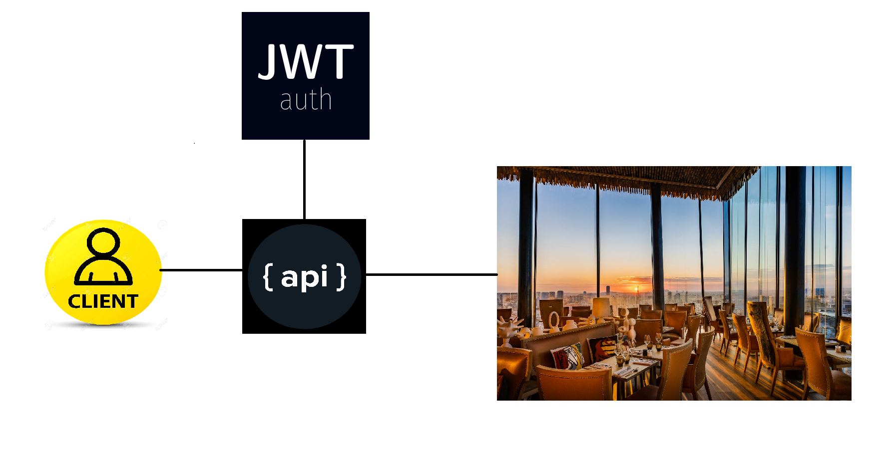
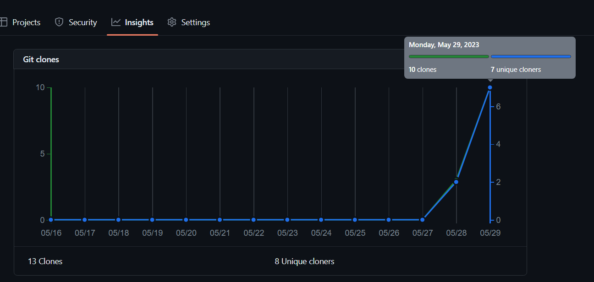
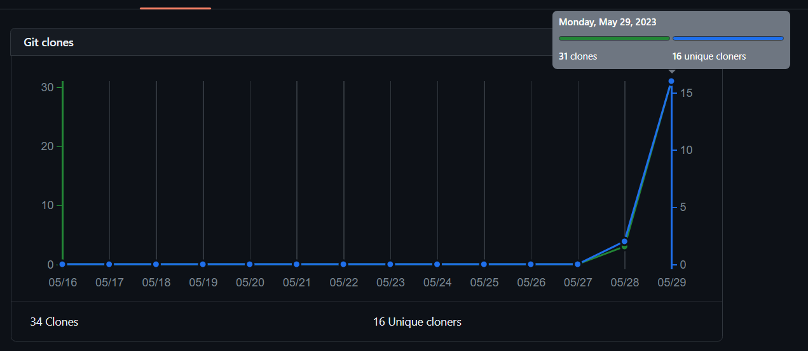

# Документация к API 
https://documenter.getpostman.com/view/26375065/2s93m8xKtM

# Сервисы:
1. Auth - регистарция, авторизация, подтвержение личности
2. Restaurant - предоставление меню, создание и отслеживание заказов, CRUD для блюд(только для менаджера)
3. Gateway - клей

## Аккаунт админа
С помощью него можно регистрировать клиентов, менаджеров, шефов(для чего они кстати) и админов
```
email: admin@gmail.com
password: 123456
```

## Аккаунт менаджера
Создать можно при помощи аккаунта админа, но он тут на всякий случай
```
email: manager@gmail.com
password: 123456
```

# Базы данных:
### Ресторан:
```
url: jdbc:h2:file:~/data/orders;AUTO_SERVER=TRUE
username: verysafeusername
password: evensaferpassword
```
### Пользователи: 
```
url: jdbc:h2:file:~/data/users;AUTO_SERVER=TRUE
username: verysafeusername
password: evensaferpassword
```

# Список вольностей при выполении дз:
1. Нет таблицы для хранения токенов
2. При создании заказа нужно указывать Id пользователя (Вроде как лучше обратиться к 
сервису с аккаунтами и попросить его распарсить JWT и узнать Id пользователя, но в требованиях об этом не сказано)
(И вообще вдруг менаджер захочет оформить кому то заказ за свой счёт)

# Порядок запуска:
```
ServerApplication -> AuthApplication -> RestaurantApplication -> GatewayApplication

```

Но можно и нарушать, главное соблюсти ```ServerApplication -> GatewayApplication```

Docker делать не стал, а make было лень устанавливать((

Извиняюсь за ошибки в буковках
# Архитектура:


# А вот это как то уже и не смешно... сидишь целую неделю за проектом, а потом мда

# Доброе утро

